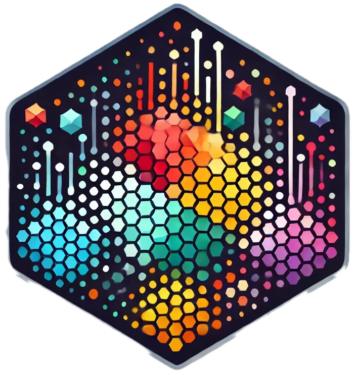

# tidyvec 

<!-- badges: start -->
[](https://flmnh-ai.github.io/tidyvec/)
[](https://github.com/flmmh-ai/tidyvec/actions)
[](https://lifecycle.r-lib.org/articles/stages.html#experimental)
[](https://CRAN.R-project.org/package=tidyvec)
<!-- badges: end -->

## Overview

tidyvec is a lightweight vector database for the tidyverse ecosystem. It enables you to:

- Store and query vector embeddings alongside your data in tibbles
- Generate embeddings for text and images
- Find similar items using vector similarity search
- Visualize embedding spaces
- Seamlessly integrate with dplyr, ggplot2, and other tidyverse packages

## Why tidyvec?

While specialized vector databases like FAISS and Pinecone offer high performance for large-scale applications, they often require leaving the familiar tidyverse workflow. tidyvec bridges this gap by:

- **Keeping it tidy**: Store embeddings right in your tibbles
- **Familiar syntax**: Use standard dplyr verbs before and after vector operations
- **Low friction**: No need to switch contexts between data wrangling and similarity search
- **Multimodal support**: Work with text, images, or any data type that can be embedded

## Installation

You can install tidyvec from GitHub:

```r
# install.packages("remotes")
remotes::install_github("flmnh-ai/tidyvec")
```

For neural embedding models via HuggingFace, Python dependencies (torch, transformers, pillow, etc.) will be automatically provisioned in an ephemeral virtual environment on first use of `embedder_hf()`.

## Basic Usage

### Text Embeddings and Search

```r
library(tidyverse)
library(tidyvec)

# Create a collection of books
books <- tibble(
  title = c(
    "The Art of Data Science",
    "Advanced R Programming",
    "Tidy Data Visualization",
    "Statistical Learning Methods",
    "Machine Learning with R"
  ),
  description = c(
    "A comprehensive guide to data analysis using modern techniques",
    "Deep dive into R programming for advanced users",
    "Creating beautiful visualizations with ggplot2 and the tidyverse",
    "Introduction to statistical learning methods and their applications",
    "Practical machine learning approaches with R examples"
  )
)

# Create a TF-IDF embedder and embed the descriptions
embedder <- embedder_tfidf(books$description)
books_vec <- books %>%
  vec(embedding_fn = embedder) %>%
  embed(content_column = "description")

# Find similar books
nearest(books_vec, "data visualization techniques") %>%
  select(title, similarity)
```

### Working with Images

```r
# Create a CLIP embedder for images
clip_embedder <- embedder_hf("openai/clip-vit-base-patch32", modality = "multimodal")

# Get paths to example images included with the package
img_paths <- c(
  cat = system.file("extdata/images", "cat.jpg", package = "tidyvec"),
  dog = system.file("extdata/images", "dog.jpg", package = "tidyvec"),
  beach = system.file("extdata/images", "beach.jpg", package = "tidyvec"),
  mountain = system.file("extdata/images", "mountain.jpg", package = "tidyvec"),
  city = system.file("extdata/images", "city.jpg", package = "tidyvec")
)

# Create an image collection
images <- tibble(
  id = names(img_paths),
  path = unname(img_paths),
  category = c("pet", "pet", "nature", "nature", "urban")
) %>%
  vec(embedding_fn = clip_embedder) %>%
  embed(content_column = "path")

# Find images similar to text
nearest(images, "a cat playing") %>%
  select(id, path, similarity)

# Find similar images and visualize them
nearest(images, "a dog on a beach") %>%
  viz_images(path_column = "path", label_columns = c("id", "category"))
```

## Key Features

### Vector Collections

The `vec()` function transforms a tibble into a vector collection:

```r
# Create a basic collection
my_collection <- tibble(text = c("sample text", "another example")) %>%
  vec()

# With a custom embedding function
my_collection <- tibble(text = c("sample text", "another example")) %>%
  vec(embedding_fn = my_custom_embedder)
```

### Embedding Generation

Generate embeddings using built-in or custom embedding functions:

```r
# TF-IDF embeddings
documents <- tibble(text = c("sample text", "another example")) %>%
  vec(embedding_fn = embedder_tfidf(.$text)) %>%
  embed(content_column = "text")

# HuggingFace neural embeddings
comments <- tibble(text = c("I love this product", "Terrible experience")) %>%
  vec(embedding_fn = embedder_hf("sentence-transformers/all-MiniLM-L6-v2")) %>%
  embed(content_column = "text")
```

### Similarity Search

Find similar items with the `nearest()` function:

```r
# Find nearest neighbors
nearest(my_collection, "query text", n = 5)
```

### Embedding Visualization

Visualize your embedding space:

```r
my_collection %>%
  viz_embeddings(method = "umap", labels = "id", color = "category")
```

## Advanced Examples

### Combining with Tidyverse Operations

```r
# Filter first, then search
books_vec %>%
  filter(year >= 2020) %>%
  nearest("visualization techniques", n = 2)

# Search first, then filter results
books_vec %>%
  nearest("R programming", n = 10) %>%
  filter(similarity > 0.5) %>%
  arrange(desc(year))
```

### Building a Simple RAG (Retrieval-Augmented Generation) System

```r
# Split document into chunks
document_chunks <- tibble(
  chunk_id = paste0("chunk", 1:10),
  text = c("R is a programming language for statistical computing.", 
           "The tidyverse is a collection of R packages for data science.", 
           # ... more chunks
           ),
  source = "R Documentation"
) %>%
  vec(embedding_fn = embedder_tfidf(.$text)) %>%
  embed(content_column = "text")

# Query relevant chunks
query_results <- document_chunks %>%
  nearest("How do I visualize data in R?", n = 3)

# Use results to generate an answer with an LLM
query_results %>%
  select(text, similarity)
```

## Contributing

Contributions are welcome! Please feel free to submit a Pull Request.

## License

This package is licensed under the MIT License - see the LICENSE file for details.
